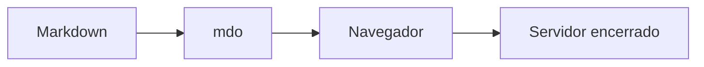

# mdo

Leitor descartável de Markdown para o terminal e navegador, escrito em Go.


## Uso durante o desenvolvimento

```bash
go run . README.md
```

O `mdo` valida o arquivo, escolhe uma porta local livre, abre o navegador e encerra o servidor assim que a página e os diagramas Mermaid terminam de renderizar. A página já carregada continua disponível, mas não pode ser recarregada depois que o servidor encerra.

Somente arquivos com extensão exata `.md` são aceitos.

## Recursos

- CommonMark e GitHub Flavored Markdown
- tabelas, listas de tarefas, autolinks e texto tachado
- notas de rodapé e listas de definição
- syntax highlighting
- sumário e links de títulos
- cópia de blocos de código
- diagramas Mermaid offline
- imagens relativas ao arquivo Markdown

## Instalação por release

Os instaladores baixam o pacote adequado dos assets da última release do GitHub e instalam o executável no sistema.

### Linux

```bash
chmod +x ./install-linux.sh
./install-linux.sh
```

Instala o `mdo` em `/usr/local/bin/mdo`.

### macOS

```bash
chmod +x ./install-mac.sh
./install-mac.sh
```

Instala o `mdo` em `/usr/local/bin/mdo`.

### Windows

Abra o PowerShell com **Executar como administrador** e execute:

```powershell
.\install-windows.ps1
```

Instala o `mdo.exe` em `$env:ProgramFiles\mdo` (normalmente `C:\Program Files\mdo`) e adiciona esse diretório ao `PATH` do sistema, disponível para todos os usuários e preservado após reiniciar ou desligar o computador. A instalação exige administrador para gravar nesse diretório e alterar a variável do sistema.

O instalador também atualiza o `PATH` da sessão atual do PowerShell. O comando fica disponível imediatamente no terminal em que você executou o script:

```powershell
Get-Command mdo
mdo .\README.md
```

Outros terminais que já estavam abertos precisam ser fechados e reabertos para receber o novo `PATH`. Se estiver usando o Windows Terminal, feche todas as janelas do aplicativo e abra-o novamente.

## Instalação global com Go

Para instalar a versão publicada do módulo:

```bash
go install github.com/egomes/mdo@latest
```

O executável será instalado em `GOBIN` ou, quando essa variável não estiver definida, em `$(go env GOPATH)/bin`. Esse diretório precisa estar no `PATH`.

## Testes

```bash
go test ./...
```

Para incluir o detector de condições de corrida:

```bash
go test -race ./...
```

## Releases e binários

Ao publicar uma GitHub Release com uma tag semântica, por exemplo `v0.1.0`, o CI executa os testes e anexa à própria release os seguintes pacotes:

| Sistema | Arquitetura | Arquivo |
| --- | --- | --- |
| Linux | amd64 | `mdo-linux-amd64.tar.gz` |
| Linux | arm64 | `mdo-linux-arm64.tar.gz` |
| macOS | amd64 | `mdo-darwin-amd64.tar.gz` |
| macOS | arm64 | `mdo-darwin-arm64.tar.gz` |
| Windows | amd64 | `mdo-windows-amd64.zip` |
| Windows | arm64 | `mdo-windows-arm64.zip` |

O arquivo `checksums.txt` contém os hashes SHA-256 de todos os pacotes. Não é necessário manter um repositório separado para os binários.

Para criar uma release pela CLI do GitHub:

```bash
gh release create v0.1.0 --generate-notes
```

A publicação da release dispara o build automaticamente. Os binários também ficam disponíveis na página de releases:

```text
https://github.com/EduardoNGomes/mdo/releases
```


