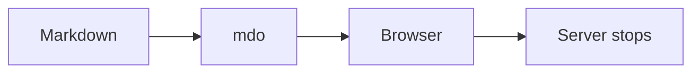
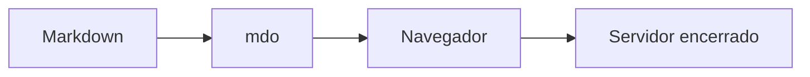

# mdo

[English](#english) · [Português](#português)

> [!NOTE]
> This is a vibe-coded project: it is built experimentally with AI-assisted
> coding and human direction/review.


## English

`mdo` is a disposable Markdown reader for the terminal and browser, written in Go.

### Development usage

```bash
go run . README.md
```

`mdo` validates the file, chooses a free local port, opens the browser, and
shuts down the server after the page and Mermaid diagrams have rendered. The
already loaded page remains available, but it cannot be reloaded after the
server stops.

Only files with the exact `.md` extension are accepted.

### Share temporarily over the internet

Use `--live` (or `-l`) to create a temporary public link through ngrok:

```bash
mdo --live README.md
# or
mdo -l README.md
```

First, install the [ngrok Agent CLI](https://ngrok.com/download), create or
sign in to your account, and configure your authtoken once:

```bash
ngrok config add-authtoken <YOUR_TOKEN>
```

`mdo` prints the HTTPS link to share and keeps the server and tunnel running
until you press `Ctrl+C`. This mode uses only the automatically assigned free
development domain: it does not configure a reserved domain or paid features.
See the [ngrok quickstart](https://ngrok.com/docs/share-localhost/quickstart)
for installation instructions and your token. Without `-l`/`--live`, `mdo`
continues to run only on localhost and does not look for or require ngrok.

### Features

- CommonMark and GitHub Flavored Markdown
- tables, task lists, autolinks, and strikethrough text
- footnotes and definition lists
- syntax highlighting
- table of contents and heading links
- code block copying
- offline Mermaid diagrams
- images relative to the Markdown file

### Install from a release

The installers download the package for the current platform from the latest
GitHub Release and install the executable on the system.

### Install with a package manager

Once published to npm, install `mdo` globally with one of these commands:

```bash
npm install --global @egomes.dev/mdo
pnpm add --global @egomes.dev/mdo
yarn global add @egomes.dev/mdo # Yarn Classic
```

The npm package selects the native binary for your operating system and CPU.
Check for a newer release or install it with:

```bash
mdo update --check
mdo update
```

`mdo update` uses the package manager that originally installed the command.

#### Linux

```bash
chmod +x ./install-linux.sh
./install-linux.sh
```

Installs `mdo` in `/usr/local/bin/mdo`.

#### macOS

```bash
chmod +x ./install-mac.sh
./install-mac.sh
```

Installs `mdo` in `/usr/local/bin/mdo`.

#### Windows

Open PowerShell as **Run as administrator**, go to the directory that contains
`install-windows.ps1`, then run both commands in the same window:

```powershell
Set-ExecutionPolicy -Scope Process -ExecutionPolicy Bypass -Force
.\install-windows.ps1
```

The script-policy change applies only to the current session and is discarded
when the PowerShell window closes.

The installer places `mdo.exe` in `$env:ProgramFiles\mdo` (usually
`C:\Program Files\mdo`) and adds that directory to the system `PATH` for all
users. Administrator rights are required to write to this location and update
the system environment variable.

The installer also updates the `PATH` in the current PowerShell session, so the
command is immediately available:

```powershell
Get-Command mdo
mdo .\README.md
```

Other terminals already open must be closed and reopened. If you use Windows
Terminal, close all its windows before opening it again.

### Install globally with Go

```bash
go install github.com/egomes/mdo@latest
```

The executable is installed in `GOBIN` or, when it is not defined, in
`$(go env GOPATH)/bin`. That directory must be in your `PATH`.

### Tests

```bash
go test ./...
```

Run the race detector with:

```bash
go test -race ./...
```



---

## Português

`mdo` é um leitor descartável de Markdown para o terminal e navegador, escrito em Go.

### Uso durante o desenvolvimento

```bash
go run . README.md
```

O `mdo` valida o arquivo, escolhe uma porta local livre, abre o navegador e
encerra o servidor assim que a página e os diagramas Mermaid terminam de
renderizar. A página já carregada continua disponível, mas não pode ser
recarregada depois que o servidor encerra.

Somente arquivos com extensão exata `.md` são aceitos.

### Compartilhar temporariamente pela internet

Use `--live` (ou `-l`) para criar um link público temporário com ngrok:

```bash
mdo --live README.md
# ou
mdo -l README.md
```

Antes disso, instale o [ngrok Agent CLI](https://ngrok.com/download), crie ou
acesse sua conta e configure o authtoken uma vez:

```bash
ngrok config add-authtoken <YOUR_TOKEN>
```

O `mdo` imprime o link HTTPS que deve ser compartilhado e mantém o servidor e
o túnel ativos até você pressionar `Ctrl+C`. O modo usa apenas o domínio de
desenvolvimento automático do plano gratuito: não configura domínio reservado
nem recursos pagos. Consulte o [quickstart do ngrok](https://ngrok.com/docs/share-localhost/quickstart)
para obter o token e instruções de instalação. Sem `-l`/`--live`, o `mdo`
continua funcionando somente em localhost e não procura nem exige o ngrok.

### Recursos

- CommonMark e GitHub Flavored Markdown
- tabelas, listas de tarefas, autolinks e texto tachado
- notas de rodapé e listas de definição
- syntax highlighting
- sumário e links de títulos
- cópia de blocos de código
- diagramas Mermaid offline
- imagens relativas ao arquivo Markdown

### Instalação por release

Os instaladores baixam o pacote adequado dos assets da última release do GitHub
e instalam o executável no sistema.

### Instalação com gerenciador de pacotes

Depois da publicação no npm, instale o `mdo` globalmente com um destes comandos:

```bash
npm install --global @egomes.dev/mdo
pnpm add --global @egomes.dev/mdo
yarn global add @egomes.dev/mdo # Yarn Classic
```

O pacote npm seleciona o binário nativo para seu sistema operacional e CPU.
Verifique se há uma release nova ou instale-a com:

```bash
mdo update --check
mdo update
```

`mdo update` usa o gerenciador de pacotes que instalou o comando originalmente.

#### Linux

```bash
chmod +x ./install-linux.sh
./install-linux.sh
```

Instala o `mdo` em `/usr/local/bin/mdo`.

#### macOS

```bash
chmod +x ./install-mac.sh
./install-mac.sh
```

Instala o `mdo` em `/usr/local/bin/mdo`.

#### Windows

Abra o PowerShell com **Executar como administrador**, acesse a pasta que contém
`install-windows.ps1` e execute os dois comandos na mesma janela:

```powershell
Set-ExecutionPolicy -Scope Process -ExecutionPolicy Bypass -Force
.\install-windows.ps1
```

A liberação de scripts acima vale somente para essa sessão do PowerShell e
termina quando a janela é fechada.

O instalador coloca `mdo.exe` em `$env:ProgramFiles\mdo` (normalmente
`C:\Program Files\mdo`) e adiciona esse diretório ao `PATH` do sistema para
todos os usuários. A instalação exige administrador para gravar nesse diretório
e alterar a variável de ambiente do sistema.

O instalador também atualiza o `PATH` da sessão atual do PowerShell. O comando
fica disponível imediatamente:

```powershell
Get-Command mdo
mdo .\README.md
```

Outros terminais que já estavam abertos precisam ser fechados e reabertos. Se
estiver usando o Windows Terminal, feche todas as janelas do aplicativo e abra-o
novamente.

### Instalação global com Go

```bash
go install github.com/egomes/mdo@latest
```

O executável será instalado em `GOBIN` ou, quando essa variável não estiver
definida, em `$(go env GOPATH)/bin`. Esse diretório precisa estar no `PATH`.

### Testes

```bash
go test ./...
```

Para incluir o detector de condições de corrida:

```bash
go test -race ./...
```


